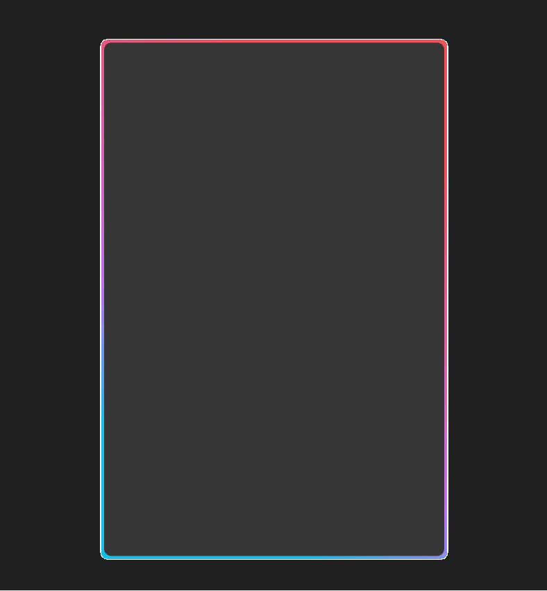

# QMLAnimationBorder

Using the QML and the animation system, we can do crazy things such animating a border of a shape (say rectangle, how original !) using the ShapePath, PathRectangle in order to do so.

## Why using ShapePath

The `ShapePath` component is used in order to draw a Shape, if you are using a `Shape` without specifying a `ShapePath`, you won't be able to see it. Actually a `Shape` is looking like an `Item` except that a `Shape` can be working with a `ShapePath` and doing so will let the `Shape` to be visible to the screen.

### What is a ShapePath

A ShapePath itself is a `Path` with additionnal properties describing the stroking and the filling parameters, such as the stroke, width and colors. The fill color or `gradient`, `join` and `cap style`, and so on. As with an ordinary `Path` component, `ShapePath` itself contains a list of path elements such as `PathMove`, `PathLine`, `PathCubic`, `PathQuad`, `PathArc`, together with a starting position.

To conclude about the `ShapePath`, it's a QML component that lets you draw `Shape` and fill it with `gradient` or even simple shape (`Rectangle`, ...). Of course, in order to use `ShapePath` correctly, that should be used with a `Shape` component. Once you make the `ShapePath` with all the properties of your choice, you will then need something to draw the shape (something called a `Path`), in this projet, I've used `PathRectangle` as what I am drawing is a rectangle.

#### Using ShapePath for making a gradient

The usage of a `ShapePath` in this project is to make a gradient with several stop depending on the position we define and also some position (2 points). These two points are the points for "begin" and the "end" of the rectangle drawing. Between these two points, you'll then be able to create some `GradientStop` component with a position (between 0 and 1) and the color for the gradient fade. 

### What is a PathRectangle

`PathRectangle` is a component that preovides an easy way to specify a rectangle, optionnaly with rounded corners. The API of the `PathRectangle` component corresponds to that of the `Rectangle` item. Using this property for the shape to be drawn, will let you set some properties that can be set inside a `Rectangle` item such as:
1. bottomLeftRadius
2. bottomRightRadius
3. height
4. width
5. radius
6. relativeX
7. relativeY
8. strokeAdjustment
9. topLeftRadius
10. topRightRadius
11. x
12. y

Using the `PathRectangle` inside of a `Shape` component, you'll be able to draw the shape how you want it to be drawn on the screen. In this projet, the usage of the `PathRectangle` is to draw the `Shape` being the rectangle border of the inner rectangle 

## Doing the animation

Right now you have the inner rectangle (simple `Rectangle` component) and its border being the `PathRectangle` inside a `Shape` that is containing a `ShapePath` to set a gradient. For the animation purpose, you could create an `Item` component centered with the `parent`, having a `ParallelAnimation` (which is a component that runs several animation in parallel - no shit sherlock -), the `ParallelAnimation` has 2 properties in this cases such as:
1. running: This property is a boolean to know whether you are running the annimation or not.
2. loops: This property is set to know the duration for the annimation to be ran, in our case, we set it to `Animation.infinite` to have the annimation running all the time.
The `NumberAnimation` are simple property modification of the component that is defined by the `id` set inside the `target` parameter. Then come the `property` you want to modify `from` a value `to` another value. In order to doing more smooth, we set a `duration` to have a smooth way to handling it

# Result

